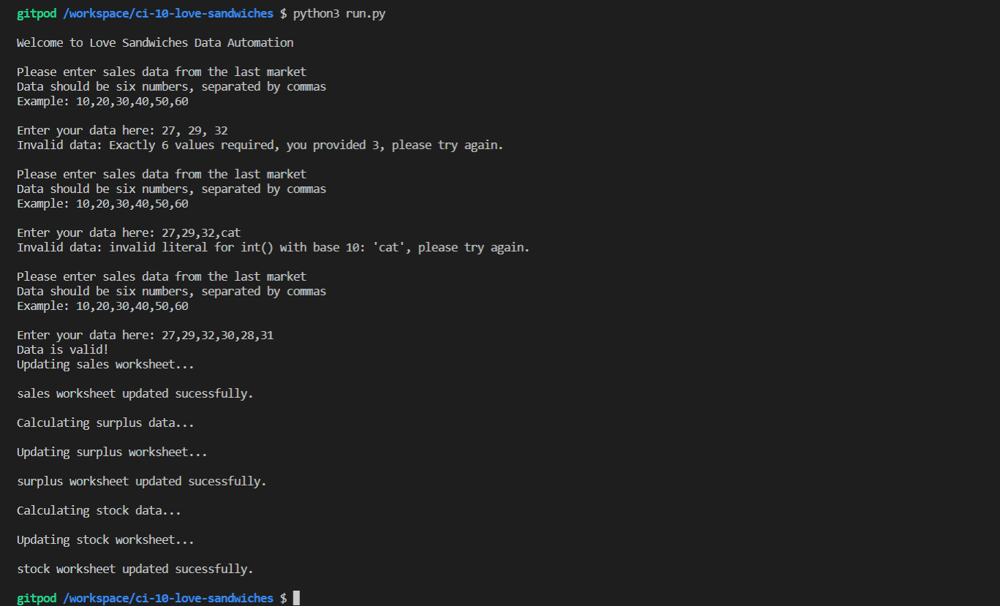

# **Love Sandwiches Project**

# Overview
Code along with instructor to produce a basic Command Line application in Python.

The application is for a sandwich vendor who attends a regular market to help them determine how many of each flavour sandwich to make up in advance of the market based on the sales at the preceding five.

Client entered data is validated on input.

The Google Sheets API is utilised, and data is both retrieved from a workbook and written to it.

# Index
1. [UX](#ux)
1. [Features](#features)
1. [Technologies Used](#technologies-used)
1. [Credits](#credits)
    * [Website](#website-credits)

## UX

### **Overview and Broad Design Choices**
The UX design for the project would have been undertaken by the Code Institute team.

## Features

### **Existing Features**
* Read from and write to a Google Sheets document via sheets API.
* Input data validation.
* Self-restart on input of invalid data.

## Technologies Used

### **Languages**
* Python is exclusively used to produce the project.
  * About: [Python homepage](https://www.python.org/)

### **Libraries and Frameworks**
* [gspread](https://docs.gspread.org/en/latest/) is used to manipulate the Google Sheet data.
* [Google Sheets API](https://developers.google.com/sheets/api/guides/authorizing) is used to store the data, and retrieve it back again.
* [pprint Data Pretty Printer](https://docs.python.org/3/library/pprint.html) is used to display information in a more user friendly fashion.

### **Tools**
* [Git](https://git-scm.com/)/[GitHub](https://github.com/) were used for version control and repository storage.
* [GitPod](https://www.gitpod.io/) was the IDE used to write the project.

### **Other Resources**
* [Code Institute Full Template](https://github.com/Code-Institute-Org/gitpod-full-template) was used to set up the repository.

## Credits

### **Website Credits**

#### Content
All content provided by Code Institute.

#### Media
The images for this README are from the following sources:
* Snips taken from GitHub/Gitpod

#### Other
* Markdown basic taken from [Mastering Markdown](https://guides.github.com/features/mastering-markdown/).

**This website was produced as an educational project for the Code Institute Full Stack Development course.**

**Created by Amy Hacker.**

[Back to Top](#love-sandwiches-project)